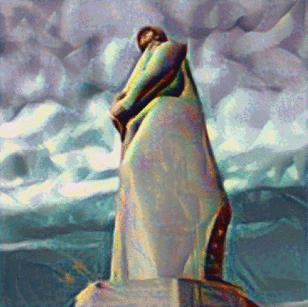

# NeuralStyleTransfer

Realisation of [article](https://arxiv.org/abs/1508.06576) in Pytorch. Main content picture is a photo of WW2 monument "Alesha" in my hometown Murmansk. There are some other photos and pics in 'images' folder.

Attention: there are some different cells for running on your local machine or in Colab.

Some future ideas for this work:

- implementing other encoder for feature extraction( VGG19 used here);

- making more different results for better understanding: how does content/style losses specification on encoder's layers affect final results?

  

